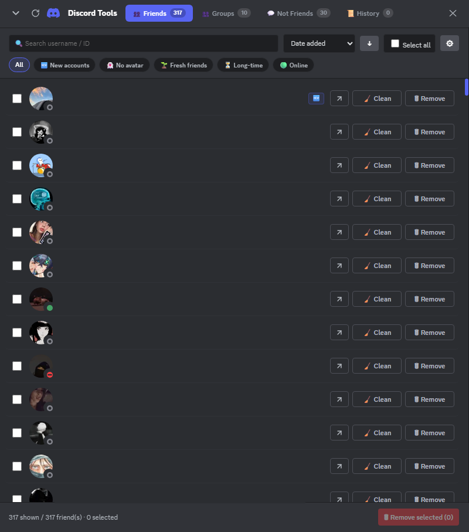

# 🛠 Discord Tools

**A powerful all-in-one userscript to manage your Discord account.**
Clean friends, groups, and DMs — all from a sleek, native-looking panel.

---

## ✨ Features

<table>
<tr>
<td width="50%">

### 👥 Friends Manager
- List, search, sort, and filter all your friends
- **Live presence dots** (🟢 Online · 🟡 Idle · 🔴 DND · ⚫ Offline) directly on avatars, refreshed every 15 s
- Filter chips: All · 🆕 New accounts · 👻 No avatar · 🌱 Fresh friends · ⏳ Long-time · 🟢 Status (cycles online → idle → dnd → offline)
- Advanced filters: added-after / added-before date range, avatar type (default/custom)
- Sort by: date added, name, account created, last DM
- Remove individually or in bulk
- Optional: clean your DM messages before removing
- Optional: auto-close the DM in the sidebar
- Click avatar/name to view profile, or ↗ to open the DM

</td>
<td width="50%">

### 👥 Groups Manager
- List all your group DMs (owned & joined)
- Filter chips: All · 👤 Solo · ✏️ Named · 💤 Inactive (90+ d) · 🆕 Recent · ⏳ Old
- Advanced filters: created-after / created-before date range, icon type
- Sort by: date created, last activity, name, members
- Leave individually or in bulk
- **🔇 Silent mode** — leave without notifying other members
- Optional: delete your messages *before* leaving

</td>
</tr>
<tr>
<td width="50%">

### 💬 Not Friends
- All DMs from people who aren't in your friend list
- Filter chips: All · 💬 With my messages *(click again to toggle to 🚫 Without my messages)* · 📭 Empty · 🆕 New accounts · 👻 No avatar · 🟢 Status
- **Deep scan** of every conversation to count your messages and detect truly empty threads
- Live progress bar during the scan (controls locked while running)
- Clean + close in one click, individually or in bulk
- Badges: 🆕 new account · 👻 no avatar · 💬 N msgs from you · 📭 truly empty · 💤 you never replied

</td>
<td width="50%">

### 📜 Universal History
- Logs every friend removed, group left, non-friend DM cleaned
- Search by name/ID, filter by type (👤 Friends / 👥 Groups / 💬 Not-friends)
- Live stats: per-kind counts + total messages deleted
- Shows context per entry: friend since, silent leave, DM closed, messages deleted…
- Clear all with confirmation

</td>
</tr>
</table>

---

## 🎨 Highlights

- **Native Discord look** — same fonts, colors, and interactions
- **Floating draggable window** — collapse, move, reload, close
- **Adaptive rate-limit handling** — smart backoff, no manual cooldowns
- **Live progress bars** — global counter (red/blue) + per-conversation secondary tracker
- **Loading modal** with smooth progress on startup
- **Native-style profile modals** fallback (webpack `USER_PROFILE_MODAL_OPEN` dispatch, or deep-link to `discord://`)
- **Zero dependencies** — pure vanilla JavaScript

---

## 🚀 Installation

1. Open **Discord** in your browser → `discord.com/app`
2. Open the **DevTools Console** (`CTRL + SHIFT + I` or `F12` → Console tab)
3. Copy the entire content of `discord-tools.js`
4. Paste it into the console and hit **Enter**
5. The Discord Tools panel appears

> 💡 Tip: you can save the script as a **bookmarklet** or use it via a userscript manager (Tampermonkey, Violentmonkey).

---

## 👁️ Preview

---

## ⚙️ How it works

- Extracts your Discord token from **localStorage** or via **webpack modules** (`getToken()`)
- Reads presence status from Discord's **Flux PresenceStore** (validated empirically via `getStatus('000…0') === 'offline'`)
- Uses the official Discord API (`/api/v10`) with proper rate-limit handling
- All operations happen client-side — nothing is sent anywhere else
- **Preferences** stored in `localStorage` (sorts, chips, active tab…)
- **History** stored in `window.name` (survives page reloads within the same tab, cleared when the tab is closed)

---

## 🔒 Privacy

- No external server, no analytics, no tracking
- Your token never leaves your browser
- Everything runs locally on `discord.com`

---

**Made with ❤️ for the Discord community**

